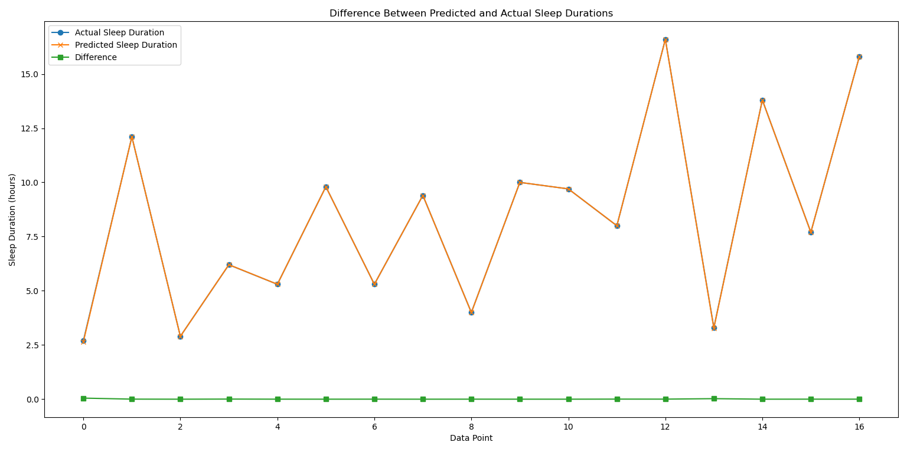

# MultiLinearSleepModel
Predicts animal sleep duration using multiple linear regression.
# Sleep Duration Prediction for Different Species

## Project Overview
This project aims to predict the total sleep duration for various species using a multiple linear regression model. By analyzing different species' attributes, the project seeks to identify relationships between physiological traits and sleep patterns, providing insight into sleep behavior across the animal kingdom.

## Table of Contents
1. [Dataset](#dataset)
2. [Data Preprocessing](#data-preprocessing)
    - [Handling Missing Values](#handling-missing-values)
    - [Categorical Encoding](#categorical-encoding)
3. [Modeling](#modeling)
4. [Plotting Results](#plotting-results)
    - [Actual vs. Predicted Sleep Durations](#actual-vs-predicted-sleep-durations)
    - [Error Plot](#error-plot)
5. [Visualization](#visualization)

## Dataset
This project utilizes the `msleep.csv` dataset, which contains various features related to different animal species. Key features include:
- **Body Weight** (`bodywt`)
- **Brain Weight** (`brainwt`)
- **Time Awake** (`awake`)
- **REM Sleep Duration** (`sleep_rem`)
- **Diet Type** (`vore`: carnivore, herbivore, omnivore, or insectivore)

The target variable for prediction is **Total Sleep Duration** (`sleep_total`), representing the total hours a species typically sleeps.

## Data Preprocessing
To prepare the dataset for modeling, the following preprocessing steps were applied:

### Handling Missing Values
Missing values were addressed using the `SimpleImputer` with a mean strategy, replacing any missing data in numerical columns with the mean value of the respective column.

### Categorical Encoding
Categorical features, such as diet type (`vore`), were transformed into numerical format using `OneHotEncoder`. This approach enables the regression model to incorporate categorical data without introducing bias.

## Modeling
A multiple linear regression model was employed to predict sleep duration based on the selected features. The model attempts to find relationships between various physiological and behavioral characteristics and the total sleep duration across different species.

## Plotting Results
The results of the model predictions are visualized through line plots, providing a clear understanding of the model’s performance:

### Actual vs. Predicted Sleep Durations
A line plot displays the **actual** vs. **predicted** sleep durations for each species. This plot helps illustrate the model's ability to predict sleep duration closely matching the actual values.

### Error Plot
An additional plot shows the **error** (difference) between the actual and predicted values, highlighting discrepancies and helping identify potential areas for model improvement.

## Visualization
The line plots (`LinePlot.png`) serve as essential visual aids, allowing for an intuitive understanding of model performance and predictive accuracy. Observing these discrepancies can offer insights into the limitations of the model and suggest directions for further refinement.

---

